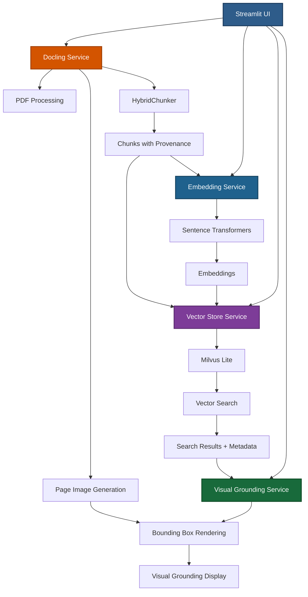

# RAG with Docling - Visual Grounding PDF Search

A RAG (Retrieval-Augmented Generation) application built with **Docling**, **Streamlit**, and **Milvus** that provides semantic search over PDF documents with **visual grounding** capabilities.

## ✨ Features

### 🔍 **Semantic Search**
- Upload PDFs or provide URLs to create a searchable knowledge base
- Uses sentence transformers for high-quality embeddings
- Vector similarity search powered by Milvus Lite
- Adjustable result count and search parameters

### 🎯 **Visual Grounding**
- See **exactly where** search results came from in the original document
- Blue bounding boxes highlight matching text regions on page images
- Multi-page support with automatic page grouping
- Relevance scores for each result

### 📄 **Advanced Document Processing**
- Powered by [Docling](https://github.com/docling-project/docling) for high-quality PDF conversion
- OCR support for scanned documents
- Table structure extraction and recognition
- Metadata extraction (title, authors, quality scores)
- GPU/MPS acceleration support

### 🧩 **Intelligent Chunking**
- Uses Docling's `HybridChunker` to preserve document structure
- Maintains provenance information (page numbers, bounding boxes)
- Optimal chunk sizes for semantic search

## 🚀 Quick Start

### Prerequisites
- Python 3.10+
- [Astral UV](https://github.com/astral-sh/uv)

### Installation

Clone the repository and:

```bash
cd rag-with-docling

# Install dependencies
uv sync
```

### Run the Application

```bash
cd ui
uv run streamlit run app.py
```

The app will open in your browser at `http://localhost:8501`

## 📖 Usage

### 1. Upload Tab
- **Upload a PDF** file from your computer, or
- **Provide a URL** to a publicly accessible PDF
- Click "🚀 Process" to analyze the document

The system will:
- Extract text and structure from the PDF
- Generate page images for visual grounding
- Create chunks with provenance metadata
- Generate embeddings and store in vector database

### 2. Document Tab
- View the extracted markdown content
- Download the processed document
- Browse individual chunks
- See document metrics (processing time, quality, table count)

### 3. Query Tab
- Enter questions about your document
- Get semantically relevant results ranked by similarity
- View combined context for LLM integration
- See recent query history

### 4. Visual Grounding Tab
- **See where your answers came from!**
- Each search result shows:
  - Highlighted bounding boxes on page images
  - Page numbers where the result appears
  - Relevance scores
  - Full text content
- Browse all document pages
- Visual confirmation of source locations

## 🏗️ Architecture



### Components

- **Docling Service**: PDF processing, OCR, table extraction, image generation
- **Embedding Service**: Text to vector embeddings using sentence-transformers
- **Vector Store Service**: Milvus Lite for efficient similarity search with metadata
- **Visual Grounding Service**: Bounding box drawing and coordinate transformation

## ⚙️ Configuration

Edit settings in `ui/models.py`:

```python
class ProcessingConfig:
    use_ocr: bool = True              # Enable OCR for scanned PDFs
    use_table_structure: bool = True  # Extract table structures
    num_threads: int = 8              # Processing threads
    accelerator: str = "mps"          # mps, cuda, or cpu

class EmbeddingConfig:
    model_name: str = "all-MiniLM-L6-v2"  # Embedding model
    dimension: int = 384                   # Vector dimension

class SearchConfig:
    top_k: int = 3                    # Number of results to return
```

## 🧪 How Visual Grounding Works

1. **Document Processing**
   - PDF is converted to DoclingDocument with page images
   - `HybridChunker` creates chunks while preserving provenance

2. **Provenance Metadata**
   - Each chunk stores: `{page_no, bbox{l, r, t, b}, coord_origin}`
   - Bounding boxes define exact text locations on pages

3. **Search & Retrieval**
   - Query → Find similar chunk embeddings
   - Retrieve text + metadata for each result

4. **Visual Grounding**
   - Extract bounding boxes from metadata
   - Transform coordinates (handle bottom-left → top-left origin)
   - Draw blue rectangles on page images
   - Display alongside search results

## 📦 Project Structure

```
rag-with-docling/
├── ui/
│   ├── app.py           # Main Streamlit application
│   ├── models.py        # Pydantic models and configuration
│   ├── services.py      # Business logic (Docling, embeddings, vector store)
│   └── __init__.py
├── pyproject.toml       # Project dependencies
└── README.md
```

## 🛠️ Technologies

- **[Docling](https://github.com/docling-project/docling)**: Advanced PDF document understanding
- **[Streamlit](https://streamlit.io/)**: Web application framework
- **[Milvus Lite](https://milvus.io/)**: Vector database for similarity search
- **[Sentence Transformers](https://www.sbert.net/)**: Text embedding models
- **[Pydantic](https://pydantic.dev/)**: Data validation and settings
- **[Pillow](https://python-pillow.org/)**: Image processing for visual grounding

## 📝 Features in Detail

### Document Processing
- Multi-format support (PDF primary)
- High-quality text extraction
- Layout analysis and reading order detection
- Figure and table recognition
- Metadata extraction (title, authors, references)
- Confidence scoring for quality assessment

### Vector Search
- Fast similarity search with IVF_FLAT indexing
- Adjustable search parameters (top_k, nprobe)
- Metadata filtering capabilities
- Persistent storage with Milvus Lite

### Visual Grounding
- Automatic coordinate system detection and transformation
- Support for both normalized and absolute coordinates
- Bottom-left to top-left origin conversion
- Multi-bbox highlighting per result
- Page-grouped result display

## 🔗 Links

- [Docling Documentation](https://docling-project.github.io/docling/)
- [Docling GitHub](https://github.com/docling-project/docling)
- [Milvus Documentation](https://milvus.io/docs)
- [Streamlit Documentation](https://docs.streamlit.io/)

## 🙏 Acknowledgments

Built with [Docling](https://github.com/docling-project/docling) - an amazing open-source document understanding toolkit by IBM Research.

---

**Built with ❤️ using Docling, Streamlit, and Milvus**
